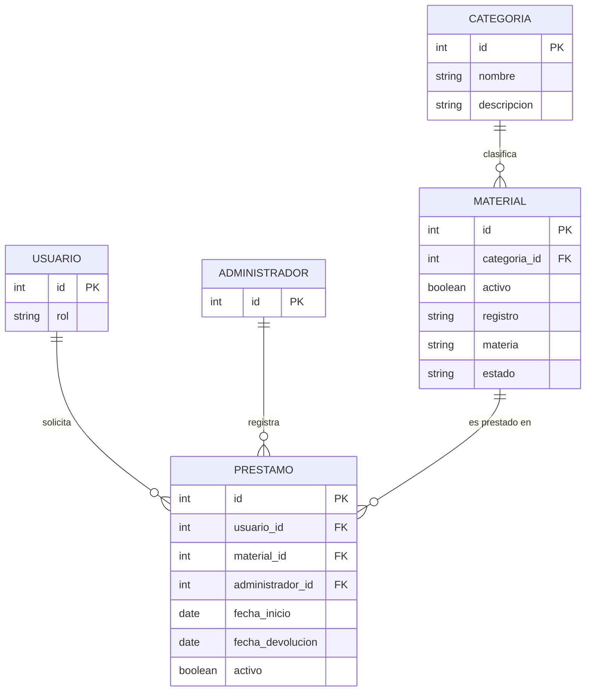

# Modelo de datos (relacional)

Modelo Entidad-Relación del sistema de préstamos, con la revisión del 2026-09-14 que sacó **Categoría** a su propia tabla.

Documentos relacionados: [Backlog](backlog.md) · [Modelo de documentos](modelo-documentos.md) · [Decisión de motor](decision-motor.md) · [Análisis y diseño](analisis-diseno.md)

> [!note] Cómo leer las tablas
> Los campos que existen por una historia concreta la traen enlazada en la columna de descripción. Los campos sin historia enlazada están marcados y se reportan como hueco en [Huecos detectados](analisis-diseno.md#5-huecos-detectados-y-que-hicimos).

---

## Diagrama



---

## Usuario

Quien solicita el material (alumno o profesor).

| Campo | Tipo | Obligatorio | Descripción |
|---|---|---|---|
| `id` | uuid (PK) | Sí | Identificador sustituto. No usamos matrícula porque la controla el mundo real y una llave primaria no debe cambiar. |
| `rol` | string | Sí | `alumno` o `profesor`. Sostiene el aislamiento de datos de [RNF1](backlog.md#rnf1-seguridad-y-aislamiento-de-datos). |

> [!question] Falta el nombre del usuario
> [HU3](backlog.md#hu3-registrar-el-prestamo-con-usuario-y-fecha) pide guardar "el nombre del usuario" y [HU6](backlog.md#hu6-consultar-el-historial-de-prestamos) pide buscar "por nombre", pero el pizarrón solo dejó `id` y `rol`. Tampoco hay correo ni credencial, que [RNF1](backlog.md#rnf1-seguridad-y-aislamiento-de-datos) necesita para autenticar. Proponemos agregar `nombre`, `identificador` (matrícula/nómina, `unique`) y `correo`; no lo damos por hecho porque no viene de nuestras notas.

## Administrador

Responsable del laboratorio que registra préstamos y confirma devoluciones.

| Campo | Tipo | Obligatorio | Descripción |
|---|---|---|---|
| `id` | uuid (PK) | Sí | Identificador sustituto. Único atributo que el pizarrón le dio. |

> [!question] Administrador casi no tiene nada propio
> Como entidad con un solo campo, es casi una tabla vacía. La diapositiva de clase resolvió lo mismo con una sola tabla `persona` con `rol` (`alumno`/`profesor`/`responsable`). Es una decisión abierta: ¿Administrador tendrá campos propios, o es el mismo actor que [Usuario](#usuario) con otro rol?

## Categoria

Clasificación del material. La sacamos a tabla propia tras la observación del profesor.

| Campo | Tipo | Obligatorio | Descripción |
|---|---|---|---|
| `id` | uuid (PK) | Sí | Sustituto. El `nombre` no sirve como llave: se corrige y se renombra. |
| `nombre` | string, `unique` | Sí | Nombre visible de la categoría. El `unique` evita duplicados tipo "Redes" / "redes " que romperían el filtro del catálogo de [HU1](backlog.md#hu1-ver-el-inventario). |
| `descripcion` | string | No | Texto opcional del catálogo. **Propuesta propia, no viene del pizarrón y ninguna historia lo lee ni lo escribe.** |

**Por qué es entidad y no atributo:** si `categoria` fuera texto suelto en Material, renombrarla obligaría a tocar N filas (anomalía de actualización), no se podría dar de alta una categoría nueva sin material (inserción) y borrar el último material de una categoría borraría la categoría (borrado).

## Material

El equipo prestable del laboratorio.

| Campo | Tipo | Obligatorio | Descripción |
|---|---|---|---|
| `id` | uuid (PK) | Sí | Sustituto. La etiqueta de inventario no es llave primaria: se reimprime y se reasigna. |
| `categoria_id` | uuid (FK → [Categoria](#categoria).id) | Sí | Categoría a la que pertenece. Sostiene el filtrado del catálogo de [HU1](backlog.md#hu1-ver-el-inventario). |
| `activo` | boolean | Sí | `false` = dado de baja; no debe aparecer en el catálogo de [HU1](backlog.md#hu1-ver-el-inventario). |
| `registro` | string | Sí | Número de registro/etiqueta de inventario. Es lo que se busca "por artículo" en [HU6](backlog.md#hu6-consultar-el-historial-de-prestamos). |
| `materia` | string | Sí | Materia con la que se asocia el material. **Ninguna historia HU1–HU6 lo lee ni lo escribe.** |
| `estado` | string | Sí | Estado físico/operativo del material (`disponible`, `prestado`, …). Lo consulta [HU1](backlog.md#hu1-ver-el-inventario). |

> [!warning] Falta la cantidad disponible
> [HU1](backlog.md#hu1-ver-el-inventario), [HU4](backlog.md#hu4-descontar-la-cantidad-disponible) y [HU5](backlog.md#hu5-registrar-la-devolucion) hablan de "cantidad disponible" que baja y sube por unidades ("5 → 4 → 5"), pero Material no tiene ningún campo numérico: solo `estado`, que es un texto de una sola pieza. O el material se modela por unidad física (una fila por aparato, y "cantidad" es un conteo de filas disponibles), o hace falta un campo `cantidad_total` / `cantidad_disponible`. Es el hueco más grande del modelo y no lo resolvemos por nuestra cuenta.

## Prestamo

Entidad de relación: existe porque Usuario, Administrador y Material se relacionan, y tiene datos propios.

| Campo | Tipo | Obligatorio | Descripción |
|---|---|---|---|
| `id` | uuid (PK) | Sí | Sustituto. |
| `usuario_id` | uuid (FK → [Usuario](#usuario).id) | Sí | Quién se llevó el material. Lo escribe [HU3](backlog.md#hu3-registrar-el-prestamo-con-usuario-y-fecha), lo lee [HU6](backlog.md#hu6-consultar-el-historial-de-prestamos). |
| `material_id` | uuid (FK → [Material](#material).id) | Sí | Qué material se llevó. Lo escribe [HU2](backlog.md#hu2-seleccionar-el-material-del-prestamo). |
| `administrador_id` | uuid (FK → [Administrador](#administrador).id) | Sí | Quién registró el préstamo. |
| `fecha_inicio` | timestamp | Sí | Momento de salida del material. Lo escribe [HU3](backlog.md#hu3-registrar-el-prestamo-con-usuario-y-fecha), lo lee [HU6](backlog.md#hu6-consultar-el-historial-de-prestamos). |
| `fecha_devolucion` | timestamp | No | `null` mientras el préstamo está abierto. Lo escribe [HU5](backlog.md#hu5-registrar-la-devolucion). |
| `activo` | boolean | Sí | `true` = préstamo abierto. Duplicado a propósito para poder poner un índice único parcial; lo apaga [HU5](backlog.md#hu5-registrar-la-devolucion). |

> [!question] No hay fecha límite de devolución
> La historia HU-08 de la Actividad 1 ("ver la fecha límite de devolución") no tiene dónde guardarse: `fecha_devolucion` es la fecha **real**, no la comprometida. Faltaría `fecha_limite` o `dias_autorizados`.

---

## Relaciones y cardinalidades

| Relación | Cardinalidad | Por qué |
|---|---|---|
| [Categoria](#categoria) — [Material](#material) | 1:N | Una categoría clasifica muchos materiales; cada material pertenece a exactamente una. |
| [Usuario](#usuario) — [Prestamo](#prestamo) | 1:N | Un usuario tiene muchos préstamos a lo largo del tiempo; cada préstamo es de un solo usuario. |
| [Administrador](#administrador) — [Prestamo](#prestamo) | 1:N | Un administrador registra muchos préstamos; cada préstamo lo registra uno solo. |
| [Material](#material) — [Prestamo](#prestamo) | 1:N | Un material se presta muchas veces en momentos distintos; cada fila de préstamo referencia un solo material. |

No usamos N:M directo entre Usuario y Material porque Préstamo ya resuelve esa relación con datos propios.

> [!warning] La cardinalidad Material—Préstamo está en duda
> Tres cosas de nuestras notas apuntan a N:M y no a 1:N: la tabla `prestamo_equipo` de la Sesión 5, el ejemplo de anomalías (tres Raspberry Pi en un mismo préstamo) y el arreglo `equipos` del ejemplo en documentos. Además [HU2](backlog.md#hu2-seleccionar-el-material-del-prestamo) dice "elige uno o varios". Conviene resolverlo antes de que haya código que asuma un solo material por préstamo.

---

## Reglas de negocio

1. **RN1 — Un material no puede estar en dos préstamos abiertos a la vez.** Se implementa con un índice único parcial sobre `material_id` filtrado por `activo`:
   ```sql
   create unique index material_en_prestamo_abierto
     on prestamo (material_id)
     where activo;
   ```
2. **RN2 — No existen préstamos de materiales, usuarios o administradores inexistentes.** Lo garantizan las llaves foráneas.
3. **RN3 — Un material dado de baja (`activo = false`) no aparece en el catálogo ni puede prestarse.** Soporta [HU1](backlog.md#hu1-ver-el-inventario).
4. **RN4 — Un préstamo abierto tiene `fecha_devolucion = null` y `activo = true`; al cerrarse se llenan ambos en la misma operación.** Soporta [HU5](backlog.md#hu5-registrar-la-devolucion).
5. **RN5 — El nombre de una categoría es único.** Restricción `unique` sobre `Categoria.nombre`; evita que el filtro de catálogo se parta en "Redes" y "redes ".
6. **RN6 — Un usuario solo puede leer sus propios préstamos; el administrador puede leer todos.** Corresponde a [RNF1](backlog.md#rnf1-seguridad-y-aislamiento-de-datos) y **no cabe en una restricción de la base**: vive en el backend. Esconder el botón no es control de acceso.
7. **RN7 — No se puede prestar más material del disponible.** Es la regla de [HU4](backlog.md#hu4-descontar-la-cantidad-disponible) y **hoy no se puede expresar**, porque no hay campo de cantidad (ver el aviso en [Material](#material)). Ver [la regla no garantizada](decision-motor.md#la-regla-no-garantizada).

> [!tip] Qué garantiza la base sola
> Llave primaria → identidad de la fila. Llave foránea → no hay préstamos de materiales inexistentes. `check` y `unique` → las reglas de dominio que caben en la base. Todo lo demás (RN6, RN7) hay que sostenerlo en la aplicación, y por eso queda escrito aquí.
