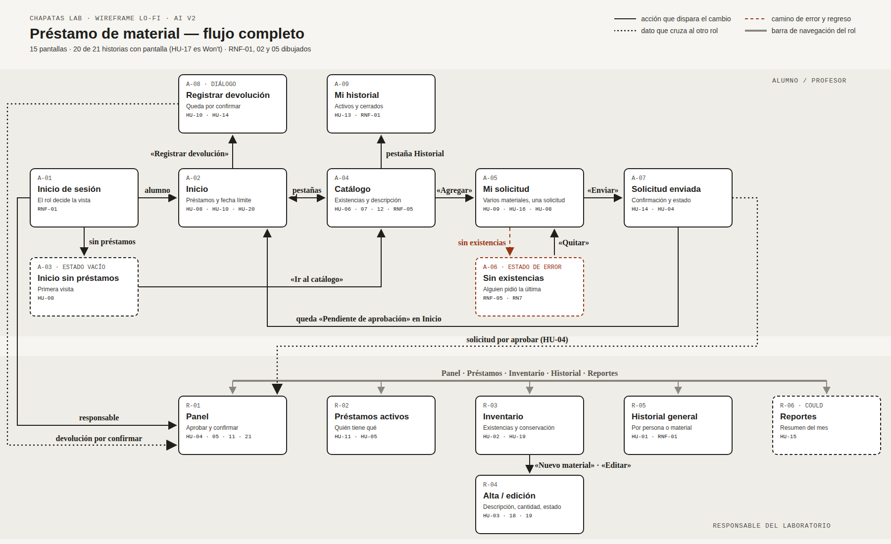

Wireframes lo-fi del sistema de préstamo de material: qué ve cada rol en cada pantalla, qué puede hacer y a dónde lo lleva cada acción. No definen colores ni estilo visual.

Documentos relacionados: [Backlog](../backlog.md) · [Análisis y diseño](../analisis-diseno.md) · [Modelo de datos](../modelo-datos.md)

## Versiones

| Versión               | Hecha                | Qué cubre                                                                                                                              | Dónde                                                                                                                                                                             |
| --------------------- | -------------------- | -------------------------------------------------------------------------------------------------------------------------------------- | --------------------------------------------------------------------------------------------------------------------------------------------------------------------------------- |
| **Handmade** · LoFi 1 | A mano, Excalidraw   | Primer boceto del equipo: Login, Principal, Catálogo, Préstamo, Historial                                                              | [handmade/Wireframe LoFi 1.md](handmade/Wireframe%20LoFi%201.md) (abrir en Obsidian con el plugin de Excalidraw)                                                                  |
| **Figma**             | A mano, en clase     | Ejercicio de clase                                                                                                                     | [demo_SD en Figma](https://www.figma.com/design/aPtkEi8sZ8v8nISSAZvPdC/demo_SD?node-id=0-1&t=zLAnDKltN3t4i3D7-1)                                                                  |
| **AI v1**             | Claude Design        | Rol Usuario, HU1–HU6: 7 pantallas + flujo                                                                                              | [ai-v1/](ai-v1/) · lienzo: <https://claude.ai/artifact/65pDvBnXTT32g3arPTEB5e> · prompt y declaración: [ai-v1/prompt.md](ai-v1/prompt.md) |
| **AI v2 (vigente)**   | Claude Design        | Backlog completo (HU-01…HU-21, RNF-01…05), dos roles, 15 pantallas + flujo + matriz                                                    | [ai-v2/](ai-v2/) · mismo lienzo que v1, versión más reciente · prompt y declaración: [ai-v2/prompt.md](ai-v2/prompt.md) |
| **AI v3**             | Claude Design (Axel) | Inventario P1–P7 de [análisis y diseño](../analisis-diseno.md#6-inventario-de-pantallas): 9 pantallas, flujo y tabla pantalla-historia | [ai-v3/README.md](ai-v3/README.md) (flujo y tabla P1–P7) · lienzo: <https://claude.ai/artifact/188Rn9nRVPHJDvVzwazyXc> · prompt y declaración: [ai-v3/prompt.md](ai-v3/prompt.md) |

`ai-v1/` y `ai-v2/` traen un PNG por pantalla y una carpeta `html/` navegable (abrir `html/Login.html` en el navegador); los PNG se renderizaron sin conexión, así que usan fuentes locales de respaldo. `ai-v3/` guarda las fuentes `.dc.html` del lienzo: dependen del runtime del editor, así que se ven desde el enlace del lienzo, no abriéndolas directo.

> [!note] Numeración
> AI v2 usa los IDs **HU-01…HU-21** y **RNF-01…05** de la Actividad 1 (backlog priorizado con MoSCoW), porque es la lista completa. AI v1 y AI v3 usan **HU1–HU6** y **P1–P7** de [backlog.md](../backlog.md) y del análisis; la equivalencia está en [Equivalencia con backlog.md](#equivalencia-con-backlogmd).

El resto de este documento describe **AI v2**, la versión vigente.

---

## Flujo de pantallas

Dos carriles: **alumno / profesor** arriba y **responsable del laboratorio** abajo. Cada flecha lleva la acción que la dispara. Las flechas punteadas en naranja son el camino de error. Las de puntos marcan el dato que cruza de un rol al otro: una solicitud que el responsable tiene que aprobar (HU-04) o una devolución que tiene que confirmar (HU-05).

Las cuatro condiciones de la actividad:

| Pide la actividad | Dónde está |
|---|---|
| Historias Must con su número en cada pantalla | Chips `HU-nn · M/S/C` arriba a la derecha de cada pantalla |
| Pantalla con el error de la regla | [A-06 · Sin existencias](ai-v2/ErrorExistencias.png): RN7 / RNF-05, alguien pidió la última unidad |
| Pantalla con estado vacío | [A-03 · Inicio sin préstamos](ai-v2/InicioVacio.png) |
| Tres marcas de accesibilidad | 3.3.2 (etiqueta visible), 2.5.8 (objetivo ≥ 24 px) y 1.4.3 (contraste, sin depender del color), anotadas en naranja junto al elemento |

---

## Pantalla → historias

| Pantalla | Imagen | Historias | RNF | Equivale a (inventario §6) |
|---|---|---|---|---|
| **A-01** Inicio de sesión | [Login.png](ai-v2/Login.png) | — | RNF-01, RNF-02 | P1 |
| **A-02** Inicio del alumno | [Inicio.png](ai-v2/Inicio.png) | HU-08, HU-10, HU-14, HU-20 | RNF-02 | *nueva* |
| **A-03** Inicio vacío | [InicioVacio.png](ai-v2/InicioVacio.png) | HU-08 | RNF-02 | *nueva* |
| **A-04** Catálogo | [Catalogo.png](ai-v2/Catalogo.png) | HU-06, HU-07, HU-12, HU-16 | RNF-02, RNF-05 | P2 |
| **A-05** Mi solicitud | [Solicitud.png](ai-v2/Solicitud.png) | HU-07, HU-08, HU-09, HU-16 | RNF-02 | P3 |
| **A-06** Error: sin existencias | [ErrorExistencias.png](ai-v2/ErrorExistencias.png) | HU-07, HU-09 | RNF-02, RNF-05 | P3 (error) |
| **A-07** Solicitud enviada | [SolicitudEnviada.png](ai-v2/SolicitudEnviada.png) | HU-04, HU-09, HU-14 | — | P4 |
| **A-08** Registrar devolución | [Devolucion.png](ai-v2/Devolucion.png) | HU-10, HU-14 | RNF-02 | *nueva* |
| **A-09** Mi historial | [Historial.png](ai-v2/Historial.png) | HU-13 | RNF-01, RNF-02 | P6 (vista del alumno) |
| **R-01** Panel del responsable | [AdminPanel.png](ai-v2/AdminPanel.png) | HU-04, HU-05, HU-11, HU-21 | — | P4, P5 |
| **R-02** Préstamos activos | [AdminPrestamos.png](ai-v2/AdminPrestamos.png) | HU-05, HU-08, HU-11 | — | P5 |
| **R-03** Inventario | [AdminInventario.png](ai-v2/AdminInventario.png) | HU-02, HU-03, HU-07, HU-18, HU-19 | — | P2 (vista del responsable) |
| **R-04** Alta / edición de material | [AdminMaterial.png](ai-v2/AdminMaterial.png) | HU-03, HU-18, HU-19 | RNF-02 | P7 |
| **R-05** Historial general | [AdminHistorial.png](ai-v2/AdminHistorial.png) | HU-01 | RNF-01 | P6 |
| **R-06** Reportes mensuales | [AdminReportes.png](ai-v2/AdminReportes.png) | HU-15 | — | *nueva* |

La misma relación en forma de matriz: [Trazabilidad.png](ai-v2/Trazabilidad.png).

## Historia → pantallas

Leída al revés, para comprobar que ninguna historia se quedó sin pantalla.

| Historia | Prioridad | Pantallas |
|---|---|---|
| HU-01 · Historial de préstamos (resp.) | M | R-05 |
| HU-02 · Inventario (resp.) | M | R-03 |
| HU-03 · Ingresar material | M | R-03, R-04 |
| HU-04 · Aprobar solicitudes | M | R-01, A-07 |
| HU-05 · Confirmar devolución | M | R-01, R-02 |
| HU-06 · Consultar materiales | M | A-04 |
| HU-07 · Cantidad disponible | M | A-04, A-05, A-06, R-03 |
| HU-08 · Fecha límite de devolución | M | A-02, A-03, A-05, R-02 |
| HU-09 · Solicitar préstamo | M | A-05, A-06, A-07 |
| HU-10 · Registrar devolución (usuario) | M | A-02, A-08 |
| HU-11 · Préstamos activos (resp.) | S | R-01, R-02 |
| HU-12 · Filtrar materiales | S | A-04 |
| HU-13 · Historial propio | S | A-09 |
| HU-14 · Notificaciones de confirmación | S | A-02, A-07, A-08 |
| HU-15 · Reportes mensuales | C | R-06 |
| HU-16 · Carrito / solicitud agrupada | C | A-04, A-05 |
| HU-17 · Cobro de material | **W** | **ninguna, a propósito**: fuera de alcance; R-06 solo lo menciona |
| HU-18 · Modificar material | M | R-03, R-04 |
| HU-19 · Estado de conservación | S | R-03, R-04 |
| HU-20 · Aviso antes de la fecha límite | C | A-02 |
| HU-21 · Aviso de devolución registrada | C | R-01 |
| RNF-01 · Acceso y aislamiento | M | A-01, A-09, R-05 |
| RNF-02 · Accesibilidad WCAG 2.1 AA | S | 9 pantallas con marcas (ver matriz) |
| RNF-03 · Rendimiento | S | sin pantalla: se verifica con la prueba de carga |
| RNF-04 · Respaldo y recuperación | M | sin pantalla: se verifica con el simulacro de restauración |
| RNF-05 · Disponibilidad actualizada | M | A-04, A-06 |

---

## Lo que el wireframe le pide al modelo de datos

Dibujar las pantallas sacó campos y estados que el [modelo de datos](../modelo-datos.md) todavía no tiene. No se cambió el modelo; queda para que el equipo decida.

| Lo pide | Pantallas | Qué falta en el modelo |
|---|---|---|
| Barra de existencias (HU-07) | A-04, A-05, R-03 | Cantidad total y disponible por material: es el **hueco 1** de [análisis y diseño](../analisis-diseno.md#5-huecos-detectados-y-que-hicimos) y la decisión abierta #1 |
| Descripción breve del material | A-04, A-05, R-04 | `Material.descripcion`: hoy solo existe `Categoria.descripcion` |
| Fecha límite de devolución (HU-08) | A-02, A-05, R-02 | `Prestamo.fecha_limite`; `fecha_devolucion` es cuándo se devolvió de verdad. Tampoco está definido **quién fija** la fecha límite |
| Aprobación (HU-04) y devolución en dos pasos (HU-10 → HU-05) | A-02, A-07, R-01 | Estados del préstamo en lugar del booleano `activo`: pendiente de aprobación, rechazada, activo, devolución por confirmar, cerrado |
| Solicitud con varios materiales (HU-16, HU-09) | A-05, A-07 | Material—Préstamo N:M: resuelve hacia N:M la decisión abierta #2 |
| Estado de conservación (HU-19) | R-03, R-04 | Un campo de conservación separado de `Material.estado` (disponible / prestado) |
| Buscar por persona, contactar | R-02, R-05 | Nombre y correo del usuario: **hueco 2** y decisión abierta #5 |
| Avisos (HU-14, HU-20, HU-21) | A-02, A-07, R-01 | Dónde se guardan las notificaciones y por qué canal salen |

## Léanlas al revés: ¿qué sobra?

Elementos dibujados que ninguna historia pide de forma literal. El equipo decide si **se justifica, se quita o falta una historia**:

- **«Rechazar…» solicitud** (R-01): HU-04 solo dice *aprobar*. Si se puede aprobar, alguien tiene que poder decir que no. Posiblemente falte una historia.
- **«Contactar»** a un alumno con préstamo vencido (R-02): ninguna historia lo pide y depende del correo del usuario, que tampoco existe.
- **«Reportar problema»** al confirmar una devolución (R-01): se apoya en HU-19, pero ninguna historia une conservación con devolución.
- **Exportar CSV** (R-06): ninguna historia lo pide. Se parece a la alternativa futura que menciona la justificación de HU-17 («registrar el adeudo y exportar el reporte»), pero esa alternativa no está en el alcance.

---

## Equivalencia con backlog.md

| backlog.md                                      | Actividad 1                                        |
| ----------------------------------------------- | -------------------------------------------------- |
| HU1 · Ver el inventario                         | HU-02                                              |
| HU2 · Seleccionar material                      | HU-09                                              |
| HU3 · Registrar préstamo con usuario y fecha    | HU-01, HU-04                                       |
| HU4 · Descontar cantidad disponible             | HU-07                                              |
| HU5 · Registrar la devolución                   | HU-05, HU-10                                       |
| HU6 · Consultar historial                       | HU-01                                              |
| RNF1–RNF4                                       | RNF-01–RNF-04                                      |
| RNF5 · Disponibilidad en horario de laboratorio | *no existe en la Actividad 1*                      |
| RNF6 · Facilidad de uso                         | *no existe en la Actividad 1*                      |
| *no existe en backlog.md*                       | RNF-05 · Disponibilidad actualizada del inventario |

> [!warning] Las dos listas de RNF no coinciden
> RNF5 significa cosas distintas en cada documento: *disponibilidad en horario* en backlog.md y *disponibilidad actualizada del inventario* en la Actividad 1. Hay que unificar antes de entregar.

---

## Declaración de uso de IA

**Herramienta:** Claude Opus 5.5 (Anthropic), ejecutado mediante Claude Code con la herramienta de diseño Claude Design, en el entorno local de un integrante del equipo.

**Contexto proporcionado:** los documentos de la carpeta `docs/` ([backlog](../backlog.md), [análisis y diseño](../analisis-diseno.md), [modelo de datos](../modelo-datos.md)), el boceto del equipo [Wireframe LoFi 1](handmade/Wireframe%20LoFi%201.md), el diagrama de flujo de clase («El flujo de pantallas») y las notas de clase del integrante: *Actividad 1 — Backlog priorizado y RNF* y *Diseño de pantallas*. Sin búsquedas en internet.

**Lo que hizo la IA:**

- Dibujar las pantallas lo-fi a partir del boceto del equipo, conservando su estructura (barra superior con pestañas, catálogo en cuadrícula, historial en lista).
- Extender el wireframe del rol Usuario (v1) al backlog completo con los dos roles (v2).
- Agregar, a pedido del equipo, la barra de existencias y la descripción breve de cada material.
- Construir la matriz de trazabilidad y las dos tablas de este documento.
- Señalar los huecos del modelo de datos y los elementos que ninguna historia pide.

**Lo que NO hizo la IA:**

- Las historias de usuario, su prioridad MoSCoW ni los RNF: vienen de la Actividad 1 del equipo.
- El boceto original ni la estructura de navegación.
- Decidir los huecos ni lo que sobra: quedan abiertos para el equipo.

**El equipo asume la responsabilidad del contenido entregado.**
