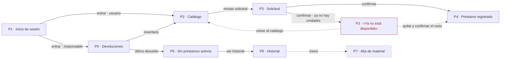

# Wireframe AI v3 (LoFi 2)

Inventario de pantallas dibujado: qué ve el usuario, qué puede hacer y a dónde lleva cada acción. Cruza el [backlog](../../backlog.md) con las pantallas de la [sección 6 del análisis](../../analisis-diseno.md#6-inventario-de-pantallas).

Documentos relacionados: [MOC Wireframes](../MOC%20Wireframes.md) · [Análisis y diseño](../../analisis-diseno.md) · [Backlog](../../backlog.md) · [Modelo de datos](../../modelo-datos.md) · [Prompt usado para generarlo](prompt.md)

---

## Dónde verlo

- Lienzo en línea: <https://claude.ai/artifact/188Rn9nRVPHJDvVzwazyXc>
- Fuentes: esta carpeta

> [!note] Sobre las fuentes
> Los archivos `.dc.html` de esta carpeta son el respaldo del lienzo, no páginas sueltas: dependen del runtime del editor (`support.js`) y no se ven bien abiertos directo en el navegador. Para verlos, usar el enlace del lienzo. [`canvas.json`](canvas.json) guarda la posición de cada tablero y las notas.

---

## Flujo de pantallas

Cada flecha lleva la acción que la dispara. El camino de error (rojo, punteado) regresa al catálogo. P7 va punteada porque ninguna historia de HU1–HU6 la pide ([hueco 6](../../analisis-diseno.md#5-huecos-detectados-y-que-hicimos)).

---

## Tabla pantalla-historia

| Pantalla | Historias / RNF | Qué muestra o captura | Marcas WCAG | Hueco o decisión |
|---|---|---|---|---|
| **P1** Inicio de sesión | [RNF1](../../backlog.md#rnf1-seguridad-y-aislamiento-de-datos) | Matrícula y contraseña; el rol decide a qué vista entra | 3.3.2 · 2.5.8 | Hueco 3 · decisión 9 |
| **P2** Catálogo | [HU1](../../backlog.md#hu1-ver-el-inventario), [HU2](../../backlog.md#hu2-seleccionar-el-material-del-prestamo), [HU4](../../backlog.md#hu4-descontar-la-cantidad-disponible), [RNF3](../../backlog.md#rnf3-rendimiento-bajo-carga) | Material, registro, categoría y disponibles; agrega a la solicitud | 3.3.2 · 2.5.8 · agotado no solo por color | Hueco 1 · decisión 1 |
| **P3** Solicitud | [HU2](../../backlog.md#hu2-seleccionar-el-material-del-prestamo), [RNF2](../../backlog.md#rnf2-accesibilidad-wcag-21-aa), [RNF6](../../backlog.md#rnf6-facilidad-de-uso) | Materiales elegidos, resumen y confirmación; orden de Tab 1 → 4 | 2.5.8 · 1.4.3 · teclado | Decisión 2 (1:N / N:M) |
| **P3** Error de la regla | [HU2](../../backlog.md#hu2-seleccionar-el-material-del-prestamo), [HU4](../../backlog.md#hu4-descontar-la-cantidad-disponible), [RN7](../../modelo-datos.md#reglas-de-negocio) | «Ya no está disponible» con dos salidas: quitar y confirmar, o volver | 1.4.3 · `role="alert"` | La regla vive en el backend |
| **P4** Préstamo registrado | [HU3](../../backlog.md#hu3-registrar-el-prestamo-con-usuario-y-fecha), [HU4](../../backlog.md#hu4-descontar-la-cantidad-disponible) | Quién, qué, cuándo y estado; disponibles antes → después | `role="status"` · 2.5.8 | Hueco 2 · hueco 7 |
| **P5** Devoluciones | [HU5](../../backlog.md#hu5-registrar-la-devolucion), [RNF2](../../backlog.md#rnf2-accesibilidad-wcag-21-aa) | Préstamos activos; confirma devolución (devuelto, disponible + 1) | 3.3.2 · 2.5.8 · Esc / Enter | — |
| **P5** Estado vacío | [HU5](../../backlog.md#hu5-registrar-la-devolucion) | Cero préstamos activos y a dónde ir después | `role="status"` · 2.5.8 | — |
| **P6** Historial | [HU6](../../backlog.md#hu6-consultar-el-historial-de-prestamos), [RNF1](../../backlog.md#rnf1-seguridad-y-aislamiento-de-datos), [RNF4](../../backlog.md#rnf4-respaldo-y-recuperacion) | Busca por persona o material; muestra fechas y estado | 3.3.2 · estado con texto e ícono | Hueco 2 · decisión 5 |
| **P7** Alta de material | **Ninguna** (propuesta: HU-03) | Nombre, registro, categoría, unidades y materia | 3.3.2 · 2.5.8 | Huecos 4 y 6 · decisión 1 |

Los números de hueco y de decisión remiten a las secciones [5](../../analisis-diseno.md#5-huecos-detectados-y-que-hicimos) y [7](../../analisis-diseno.md#7-decisiones-abiertas) del análisis.

---

## Contra lo que pide la actividad (Clase 8)

- [x] **Historias Must con su número en cada pantalla.** HU1–HU6 son todas Must; cada tablero las lleva en la barra superior.
- [x] **Una pantalla con el error de la regla.** P3 «Ya no está disponible»: otra persona confirmó la última unidad. La pantalla solo muestra el mensaje; quien decide es el backend, con una transacción que lee y descuenta en la misma operación.
- [x] **Una pantalla con estado vacío.** P5 «Sin préstamos activos»: dice qué pasa y a dónde ir, en vez de una tabla en blanco.
- [x] **Las tres marcas de accesibilidad.** 3.3.2 (etiqueta visible fuera de la caja), 2.5.8 (botones de 44 px) y 1.4.3 (contraste ≥ 4.5 : 1), marcadas en punteado azul en cada tablero.
- [ ] **Leídas al revés.** P7 no tiene historia. El equipo tiene que decidir: se justifica, se quita o falta HU-03.

### Cómo leer las marcas en el lienzo

| Marca | Significa |
|---|---|
| Pestaña negra en la barra superior | Historia o RNF que cubre la pantalla |
| Punteado azul | Marca de accesibilidad WCAG |
| Punteado naranja | Hueco detectado en el análisis |
| Contorno negro | Regla de negocio |

Los datos de las tablas (materiales, registros, fechas) son de ejemplo; las personas van como `[Alumno A]`, `[Nombre del usuario]`.
